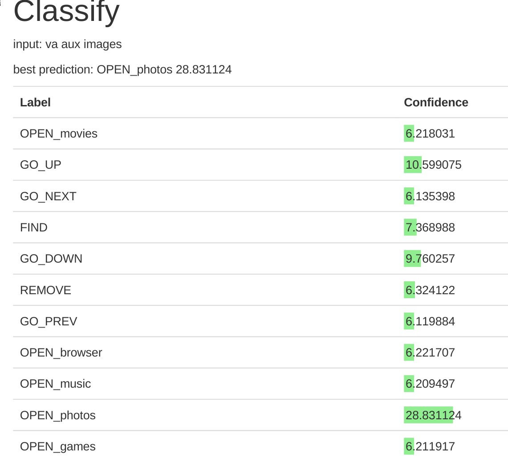
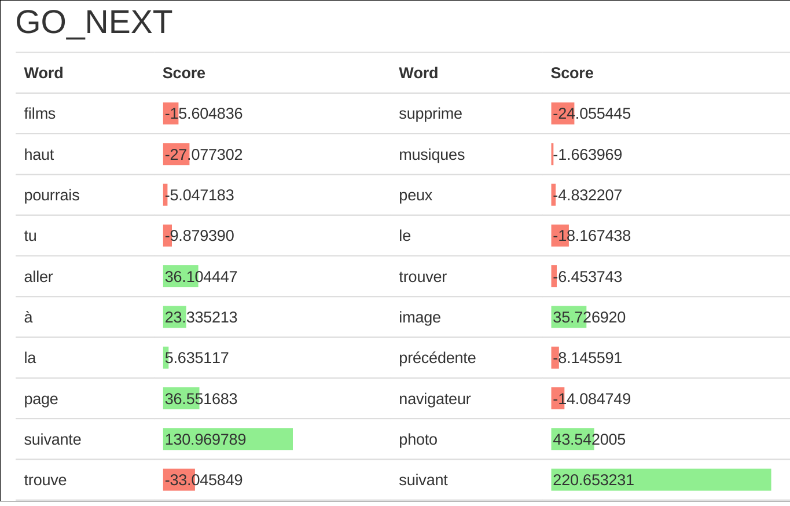

# Bag of Words

A simple bag of word classifier. Look at the file dataset.txt for the file format.

Launch the docker container, then access its port on your web browser.

*please note that this is not industrial quality code, since it lacks proper
concurrency handling mechanism. As such, doing something concurrent, like
training the model and visualizing it at the same time may cause troubles*

# Training

On the Train page, you can train your model with a file embedded in the docker
container (this will be improved later). If you built the container as is, the
only available dataset is dataset.txt. I may add later the option to upload a
dataset from the web interface.

# Using it

The Classify page lets you give an input and see how it's classified.

# Visualizing the word scores

The Weight page shows you, for each class, each word and its score. Very cute
graphs, wow, much art, such beautiful.

# Help me

Wanna help? I need a thrift interface to this.
